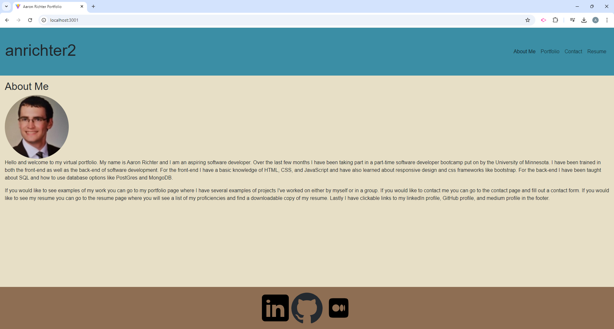
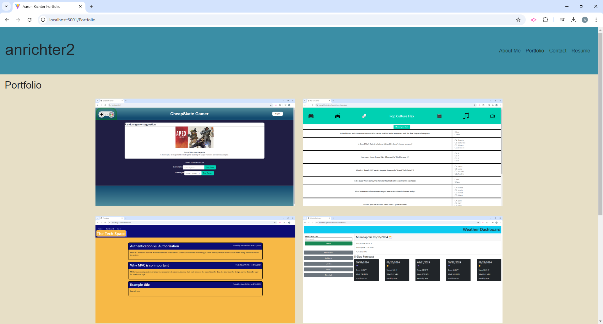
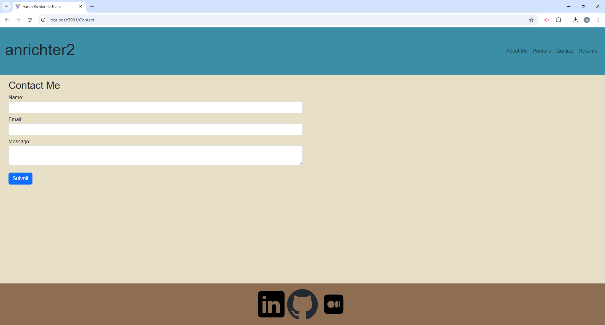
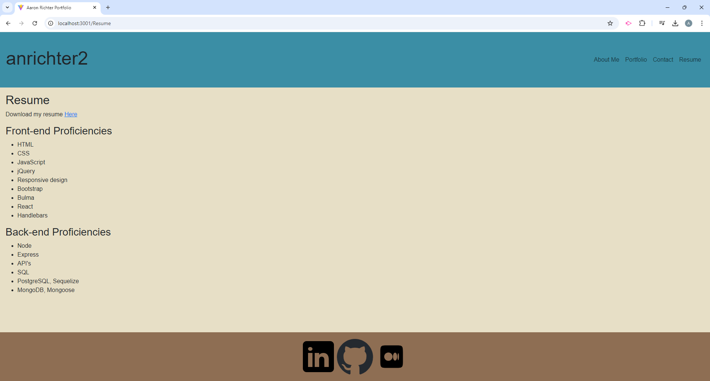

# Portfolio

## Description

The goal for this application was to create a personal virtual portfolio that I could use to showcase my work and possible use when job searching. The application uses vite and React to create a single page application(spa). The application has an about me page where I talk a little about who I am. There is also a portfolio page that displays several projects that I made either by myself or as a group. There is a contact me page that has a contact form that viewers of the portfolio can fill out to get in contact with me. Lastly there is a resume page where you can see my varies front-end and back-end proficiencies as well as a link that will download my latest resume.

## Installation

No installation is needed

## Usage

Below are screenshots showing the about me page, portfolio page, contact page, and resume page.

## Credits

LinkedIn and Medium icons provided by icons8

## License

N/A

## Contribute

N/A

## Links

[Netlify URL](https://aaron-richter-portfolio-633870.netlify.app/)